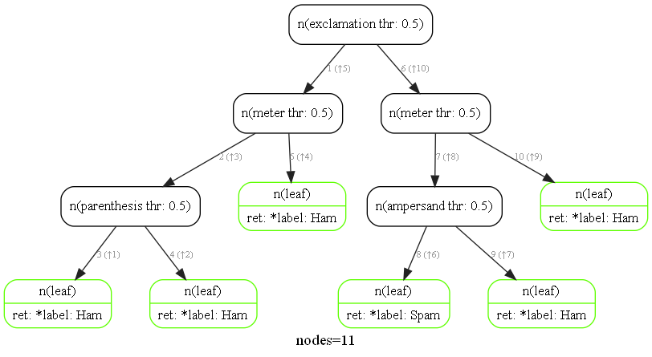

# RandomForest
This repository contains codes of a self-implemented decision tree class and random forest class in python. Also, it provides a method for visualizing a single decision tree.

Note: The decision tree I implemented is a multi-class binary decision tree.

---
#### How to use

1. Required python package
    - `numpy`
    - `scipy`
    - `matplotlib`
    - `graphviz`
    - `pygraphviz`
    - `rcviz`

1. **How to train and validate a single $\texttt{Decison Tree}$?**
    ```python
    from DecisionTree import DecisionTree

    # a dict represents the stopping criteria
    CRITERIA = {
        "max_depth": 10,
        "node_purity": None,
        "min_gain": None
    }

    """
    First, create a decision tree object.
    mode is either 'ig' or 'gini', standing for
    information gain and gini index respectively.
    """
    tree_cls = DecisionTree(X=training_data,
                            y=training_label,
                            mode='ig',
                            criteria=CRITERIA)

    """
    Then, train the decision tree given training data X and y.
    If verbose, after training, return the training evaluation.
    """
    tree_cls.train(X=training_data,
                   y=training_label,
                   verbose=True)

    """
    Finally, we can validate the decision tree model on the 
    validation data.
    """
    tree_clf.validate(val_X=val_data,
                      val_y=val_label)
    ```

    The output of the above code may be something like:
    ```
    #Train	Decision Tree | MD: 10 | NP: None | MG: None | mode: ig | val rate: ****
    Decision Tree | MD: 10 | NP: None | MG: None | mode: ig | val rate: ****
    ```
1. Useful method for cross validating $\texttt{Decison Tree}$
    ```python

    """
    Change the criteria of current decision tree.
    """
    tree_cls.set_criteria(criteria=NEW_CRITERA)
    ```


1. **How to train and validate a $\texttt{Random Forest}$?**
    ```python
    from RandomForest import RandomForest

    """
    First, create a random forest object.
    Use n_trees to specify how many trees are in the
    random forest, mode is either 'ig', 'gini' or a
    list of string constructed by 'ig' or 'gini'.
    The criteria is simlar as it defined in DecisionTree, 
    except that it can also be a list of dict.
    Sample_rate is to specify how many data are random 
    chosen to fit each tree.
    Feature_rate is to specify how many features are 
    random chosen to feed each tree.
    Seed is to specify the random shuffle seed.
    """
    forest_clf = RandomForest(n_trees=5, 
                              mode='ig', 
                              criteria=CRITERIA, 
                              sample_rate=0.6,
                              feature_rate=0.9,
                              seed=1)
    
    """
    Secondly, train each tree in the forest.
    After training, report the training evaluation.
    """
    forest_clf.fit(X=training_data,
                   y=training_label)
    
    """
    Eventually, validate the performance given X and y.
    """
    forest_clf.validate(val_X=val_data,
                        val_y=val_label)
    ```

     The output of the above code may be something like:
    ```
    #Train	Random Forest | s_rate: 0.60 | f_rate: 0.90 | mode: ['ig', 'ig', 'ig', 'ig', 'ig'] | val rate: ****
    Random Forest | s_rate: 0.60 | f_rate: 0.90 | mode: ['ig', 'ig', 'ig', 'ig', 'ig'] | val rate: ****
    ```

1. Useful methods for cross validating $\texttt{Random Forest}$
    ```python

    """
    Change the criteria of current random forest.
    After changing, clear the trees for fitting again.
    """
    forest_cls.set_criteria(criteria=NEW_CRITERA)

    """
    Change the mode of current random forest.
    After changing, clear the trees for fitting again.
    """
    forest_cls.set_mode(mode=NEW_MODE)

    """
    Change the sample rate of current random forest.
    After changing, clear the trees for fitting again.
    """
    forest_cls.set_sample_rate(rate=NEW_S_RATE)

    """
    Change the feature rate of current random forest.
    After changing, clear the trees for fitting again.
    """
    forest_cls.set_feature_rate(rate=NEW_F_RATE)
    ```


1. How to visualize a $\texttt{Decison Tree}$ using `rcviz`?

    **Firstly**, go to the file `utils.py` and setup the names of your features as well as the labels of your features like this:
    ```python
    features = [
        "feat-1", "feat-2", "feat-3", ...
    ]

    class_names = [
        "label-1", "label-2", "label-3", ...
    ]
    ```


    ```python
    from DecisionTree import DecisionTree

    """
    Make sure you have created a decision tree appropriately.
    """
    tree_cls = DecisionTree(X=training_data,
                            y=training_label,
                            mode='ig',
                            criteria=CRITERIA)
    
    """
    And also done the training process.
    """
    tree_cls.train(X=training_data,
                   y=training_label)

    """
    Then, simply adding two lines of code in main. You can get a
    plot of your decision tree.
    """
    DecisionTree.n(tree_clf.tree)
    callgraph.render("tree.png", show_null_returns=False)
    ```

    The output plot may seem like this (this is an example of using the implemented $\texttt{DecisionTree}$ to predict whether an email is ham or spam):
    

    The green nodes represent leaves.
    The meaning of `n(exclamation thr: 0.5)` is **this node chooses to split data on the feature *exclamation* and the threshold for spliting the data is 0.5** (i.e., data with feature *exclamation* <= 0.5 goes into the left branch, otherwise, it goes into the right branch).

---

#### Todo
- [ ] Implement boosting on RandomForest.
- [ ] Write a guidance on how to install and use `rcviz` package on Windows machines.
